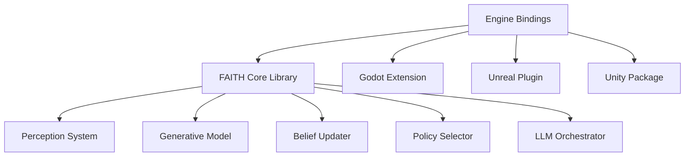

# FAITH: Free-Energy AI for Thinking Humans

**⚠️ PRE-PLANNING PHASE ⚠️**

FAITH is a proposed C++ library implementing Active Inference principles to enhance NPC behavior in games. By applying the Free Energy Principle from cognitive science, FAITH aims to create more adaptive, believable AI agents.

## Proposed System Architecture

## Conceptual Overview

Rather than replacing traditional game AI approaches like behavior trees, FAITH would enhance them with:

- **Predictive Perception**: NPCs build internal models of the game world
- **Active Inference**: Decision-making based on minimizing surprise
- **Strategic LLM Integration**: Occasional deep reasoning at key moments

## Current Status

This project is in the pre-planning and research phase. No code has been implemented yet. Everything is in constant change.

## Documentation

The repository is organized as follows:

- The `docs` folder contains conceptual documentation and design plans
- The `wiki` includes technical research and implementation proposals

## Timeline

See the [Development Timeline](docs/development-timeline.md) for the project schedule.

## License

This project is licensed under the MIT License - see the LICENSE file for details.
